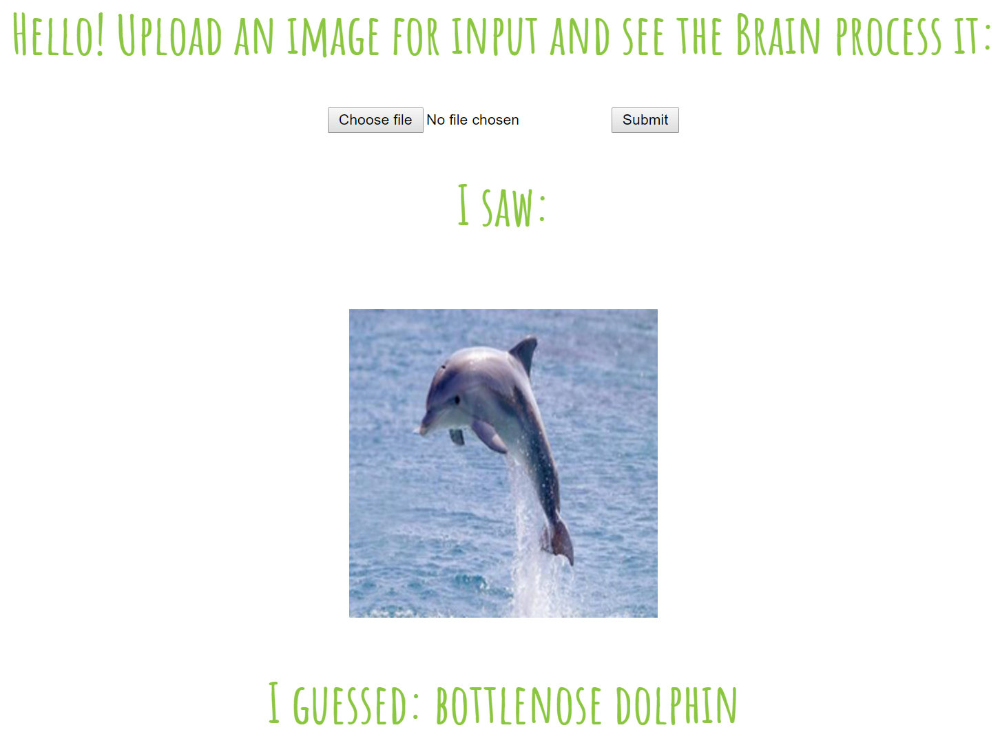

# Web Service to interact with Neural Nets

Create python-based flask server on Azure Web Apps to accept a 'POST' request with an image, process that image (in-memory), and return the processed-image along with some output text.

Here is an (http://csabyy.uksouth.cloudapp.azure.com:5005)[example] using a pre-trained resnet_152 mode:

