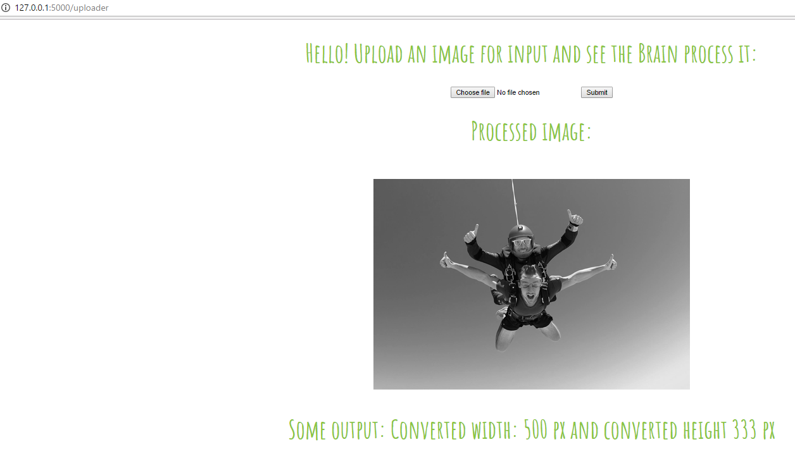

# Web Service to interact with Neural Nets

Create python-based flask server on Azure Web Apps to accept a 'POST' request with an image, process that image (in-memory), and return the processed-image along with some output text.

The main use is to replace the function `run_some_function_using_image_as_input` with perhaps a trained neural network that reads in an image and outputs an image with ROI boxes around detected features and text containing the labels.

Eventual goal is to link (input and output) with iOS/Android app using react-native / not just a web-service.

Example:

