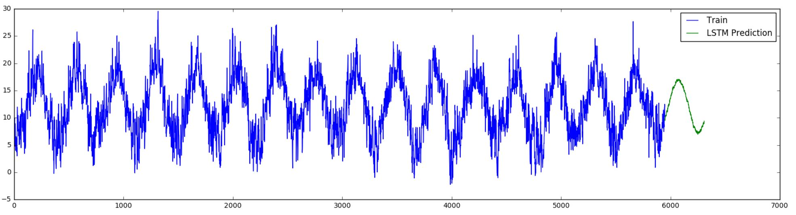
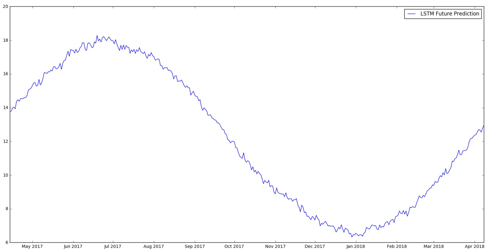

# Time Series Forecasting

Example of forecasting 360 days worth of temperature for Central London based on ~ previous 15 years worth of temperature data.

## Prophet Forecast

## LSTM Forecast

## Truth

Temperature (C) on y-axis and days since 01/01/2000 on x-axis

# Prediction for Future

